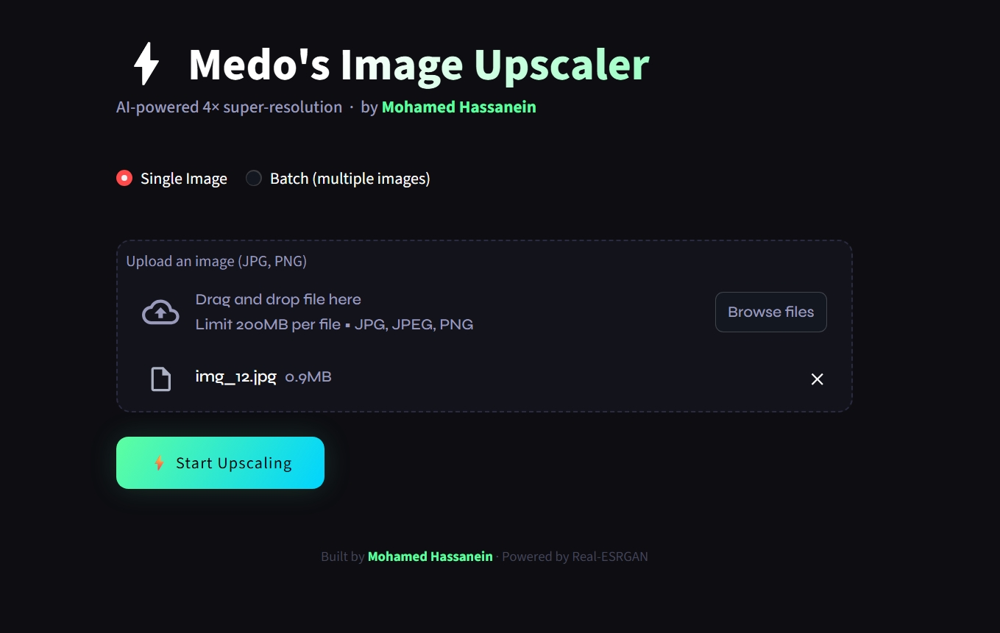

# ⚡ Medo's Image Upscaler

A clean, AI-powered image upscaler built with [Real-ESRGAN](https://github.com/xinntao/Real-ESRGAN) and Streamlit. Upscale any image to **4× its original resolution** using deep learning — directly in your browser.

> Built by [Mohamed Hassanein](https://github.com/medoyea) as a university project.

---

## Demo



---

## Features

- **4× AI Super-Resolution** using RealESRGAN_x4plus (RRDBNet architecture)
- **Single image mode** — upload one image, download it instantly as PNG
- **Batch mode** — upload multiple images, download them all as a ZIP
- Before/After preview with pixel dimensions shown
- Clean dark UI with live progress percentage
- Works on CPU and GPU (automatically detected)

---

## How It Works

Real-ESRGAN uses a deep residual-in-residual dense block network (RRDBNet) trained on degraded image pairs. It reconstructs high-frequency details lost in low-resolution images — not just blurry upscaling, but genuine detail synthesis.

---

## Installation

### 1. Clone the repo

```bash
git clone https://github.com/medoyea/image-upscaler.git
cd image-upscaler
```

### 2. Create a virtual environment (recommended)

```bash
python -m venv venv

# Windows
venv\Scripts\activate

# Mac/Linux
source venv/bin/activate
```

### 3. Install dependencies

```bash
pip install -r requirements.txt
```

> ⚠️ If you're on Windows with a CUDA GPU, install PyTorch with CUDA support first:
> ```bash
> pip install torch torchvision --index-url https://download.pytorch.org/whl/cu118
> ```
> Then run `pip install -r requirements.txt`

### 4. Run the app

```bash
streamlit run app.py
```

The app will open at `http://localhost:8501`

---

## Requirements

- Python 3.8+
- 4GB+ RAM (8GB recommended for large images)
- GPU optional but recommended for speed (tested on GTX 1650)

---

## Project Structure

```
image-upscaler/
├── app.py               # Main Streamlit web app
├── upscaling.py         # Standalone CLI batch upscaler
├── requirements.txt     # Python dependencies
├── .gitignore           # Files to exclude from git
├── assets/
│   └── screenshot.png   # App screenshot for README
└── README.md
```

---

## CLI Usage (no browser needed)

You can also run `upscaling.py` directly to batch-process a folder:

```bash
# Put your images in a folder called 'inputs'
python upscaling.py
```

Edit the bottom of `upscaling.py` to change input/output folders:

```python
input_dir  = "inputs"
output_dir = "results"
```

---

## Tech Stack

| Component | Library |
|-----------|---------|
| UI | Streamlit |
| Super-Resolution Model | Real-ESRGAN |
| Neural Network | BasicSR / RRDBNet |
| Image Processing | OpenCV, Pillow |
| Deep Learning | PyTorch |

---

## Known Issues

- First run downloads the model weights (~64MB) automatically
- Very large images (4K+) may run out of VRAM — tile size is set to 400px to mitigate this
- `half=False` is set for compatibility with GTX 16xx cards (Turing architecture doesn't support FP16 well)

---

## License

MIT License — free to use, modify, and distribute.

---

## Acknowledgements

- [Real-ESRGAN](https://github.com/xinntao/Real-ESRGAN) by Xintao Wang et al.
- [BasicSR](https://github.com/XPixelGroup/BasicSR) framework
